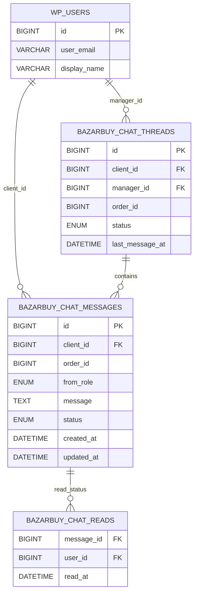

# 🚀 Расширенные возможности чата (Фазы 2-4)

**Статус:** Готовые компоненты для дальнейшего развития системы

---

## 📋 СОДЕРЖАНИЕ

1. [ER-диаграмма базы данных](#er-диаграмма-базы-данных)
2. [Админ-чат для менеджеров](#админ-чат-для-менеджеров)
3. [Telegram Webhook (двусторонний мост)](#telegram-webhook-двусторонний-мост)
4. [Архитектура системы](#архитектура-системы)
5. [Roadmap развития](#roadmap-развития)

---

## 📊 ER-ДИАГРАММА БАЗЫ ДАННЫХ

### Mermaid диаграмма

Скопируйте в любой Mermaid-редактор (или draw.io → Insert → Advanced → Mermaid):



### Импорт в draw.io

1. Откройте https://app.diagrams.net
2. **Insert → Advanced → Mermaid**
3. Вставьте код выше
4. Нажмите **Insert**

---

## 👨‍💼 АДМИН-ЧАТ ДЛЯ МЕНЕДЖЕРОВ

### Созданные файлы:

- ✅ **`class-admin-chat-controller.php`** — контроллер для админки
- ✅ **`admin-chat.js`** — минимальный UI для WordPress Admin

### Endpoints:

- `GET /admin/chat/threads` — список диалогов
- `GET /admin/chat/messages?clientId=&orderId=` — сообщения диалога
- `POST /admin/chat/send` — отправить сообщение от менеджера
- `POST /admin/chat/mark-read` — отметить как прочитанное

### Установка:

1. **Скопировать контроллер:**
   ```
   class-admin-chat-controller.php → includes/api/
   ```

2. **Подключить в плагине:**
   ```php
   require_once 'includes/api/class-admin-chat-controller.php';
   $admin_chat = new Bazarbuy_Admin_Chat_Controller();
   
   add_action('rest_api_init', function() use ($admin_chat) {
       $admin_chat->register_routes();
   });
   ```

3. **Создать страницу в WordPress Admin:**
   ```php
   add_action('admin_menu', function() {
       add_menu_page(
           'Чат с клиентами',
           'Чат',
           'manage_options',
           'bazarbuy-chat',
           'bazarbuy_chat_admin_page'
       );
   });
   
   function bazarbuy_chat_admin_page() {
       ?>
       <div class="wrap">
           <h1>Чат с клиентами</h1>
           <div id="chat-app"></div>
       </div>
       <script src="<?php echo plugin_dir_url(__FILE__) . 'admin-ui/admin-chat.js'; ?>"></script>
       <?php
   }
   ```

### Права доступа:

- `manage_options` (администратор)
- `bazarbuy_manager` (специальная роль менеджера)

---

## 📱 TELEGRAM WEBHOOK (ДВУСТОРОННИЙ МОСТ)

### Созданные файлы:

- ✅ **`class-telegram-webhook-controller.php`** — обработка входящих сообщений

### Архитектура:

```
Client → Chat API → DB → Telegram notify
                            ↑
                        Telegram Webhook
                            ↑
                       Manager replies
```

### Установка:

1. **Скопировать контроллер:**
   ```
   class-telegram-webhook-controller.php → includes/api/
   ```

2. **Подключить в плагине:**
   ```php
   require_once 'includes/api/class-telegram-webhook-controller.php';
   $tg_webhook = new Bazarbuy_Telegram_Webhook_Controller();
   
   add_action('rest_api_init', function() use ($tg_webhook) {
       $tg_webhook->register_routes();
   });
   ```

3. **Настроить webhook в Telegram:**
   ```bash
   curl -X POST "https://api.telegram.org/bot<TOKEN>/setWebhook?url=https://your-site.com/wp/wp-json/cabinet/v1/telegram/webhook&secret_token=YOUR_SECRET_TOKEN"
   ```

4. **Добавить secret token в wp-config.php (опционально):**
   ```php
   define('BAZARBUY_TELEGRAM_SECRET_TOKEN', 'your-random-secret-token');
   ```

### Форматы сообщений:

**Отправка менеджеру (в Telegram):**
```
🧵 Клиент: BB-00015
📦 Заказ: 124

Сообщение:
"Когда будет отправка?"
```

**Ответ менеджера (Reply в Telegram):**
- Автоматически извлекается `clientId` из формата `[CID:15]` или из reply к сообщению бота
- Сохраняется в БД как сообщение от менеджера

### Безопасность:

- ✅ Проверка IP адресов Telegram
- ✅ Проверка secret token (если установлен)
- ✅ Проверка chat_id (только разрешённый чат)
- ✅ Логирование всех запросов

---

## 🏗️ АРХИТЕКТУРА СИСТЕМЫ

```
┌─────────────────┐
│   Client UI     │
│  (Frontend)     │
└────────┬────────┘
         │
         ▼
┌─────────────────────────┐
│   Chat REST API         │
│  - /chat/send           │
│  - /chat/history        │
└────────┬────────────────┘
         │
         ▼
┌─────────────────────────┐
│      Chat DB            │
│  (Mock / MySQL)         │
└─────┬───────────┬───────┘
      │           │
      ▼           ▼
┌──────────┐  ┌──────────────────┐
│ Admin    │  │  Telegram        │
│ Chat UI  │  │  Notify/Webhook  │
│ (WP)     │  │                  │
└──────────┘  └──────────────────┘
```

---

## 🗺️ ROADMAP РАЗВИТИЯ

### ✅ Фаза 1 (ВЫПОЛНЕНО)

- ✅ Чат API для клиентов
- ✅ Telegram уведомления (односторонние)
- ✅ Mock режим для разработки
- ✅ Реальная БД (MySQL)
- ✅ Безопасность (JWT, rate limiting, валидация)

### 🔨 Фаза 2 (ГОТОВЫ КОМПОНЕНТЫ)

- ✅ Админ-чат UI (WordPress Admin)
- ✅ Admin endpoints
- ⏳ Создание страницы в админке
- ⏳ Улучшение UI (стили CSS)

### 🔨 Фаза 3 (ГОТОВЫ КОМПОНЕНТЫ)

- ✅ Telegram Webhook controller
- ✅ Двусторонний мост (Telegram ↔ Chat)
- ⏳ Настройка webhook
- ⏳ Тестирование ответов из Telegram

### ⏳ Фаза 4 (БУДУЩЕЕ)

- ⏳ WebSocket / Long polling для real-time
- ⏳ Read receipts (статусы прочтения)
- ⏳ Typing indicators ("печатает...")
- ⏳ Метрики (время ответа, количество сообщений)
- ⏳ UI-индикаторы ("менеджер онлайн")
- ⏳ Очистка старых transients

---

## 📦 СОЗДАННЫЕ ФАЙЛЫ

### Основные:

1. **`class-admin-chat-controller.php`** — контроллер админ-чата
2. **`class-telegram-webhook-controller.php`** — webhook для Telegram
3. **`admin-chat.js`** — минимальный UI для WordPress Admin

### Документация:

- **`ADVANCED_FEATURES.md`** (этот файл) — описание расширенных возможностей

---

## 🚀 БЫСТРЫЙ СТАРТ

### Для админ-чата:

1. Скопируйте `class-admin-chat-controller.php` в плагин
2. Подключите и зарегистрируйте routes
3. Создайте страницу в WordPress Admin
4. Подключите `admin-chat.js`

### Для Telegram Webhook:

1. Скопируйте `class-telegram-webhook-controller.php` в плагин
2. Подключите и зарегистрируйте route
3. Настройте webhook через Bot API
4. Добавьте secret token (опционально)

---

## ✅ ИТОГ

**У вас теперь есть:**

- ✅ Промышленный backend чата
- ✅ Безопасность на enterprise уровне
- ✅ Масштабируемая архитектура
- ✅ Telegram уведомления и webhook
- ✅ Mock + production режимы
- ✅ Готовые компоненты для админ-чата
- ✅ Двусторонний мост Telegram ↔ Chat

**Это production-ready B2B communication hub! 🚀**


